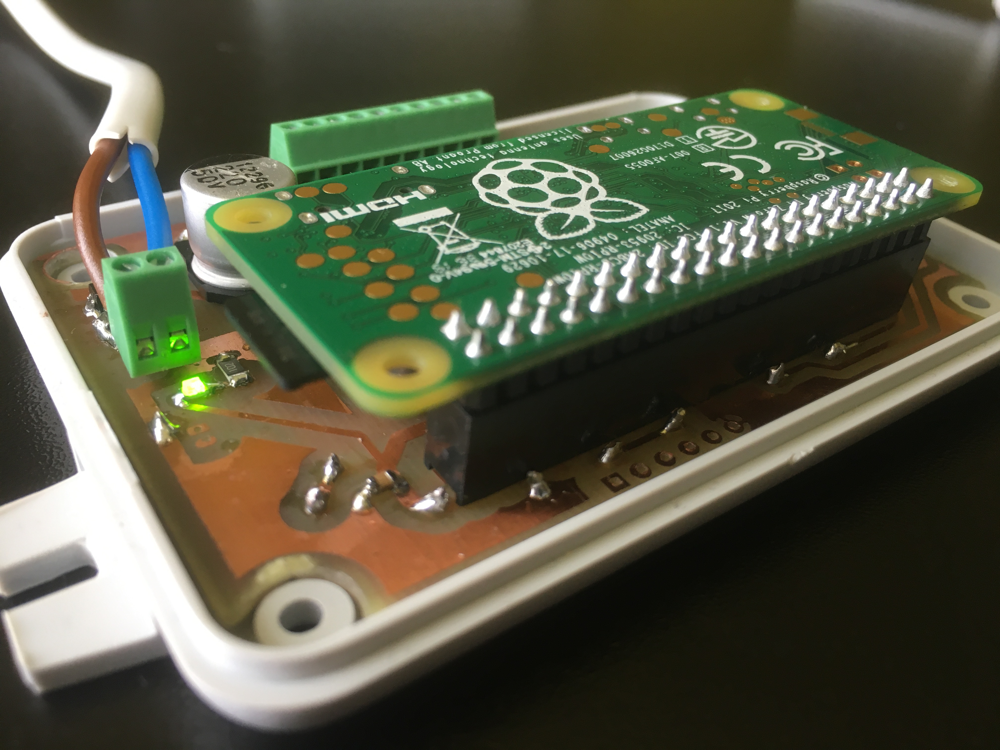
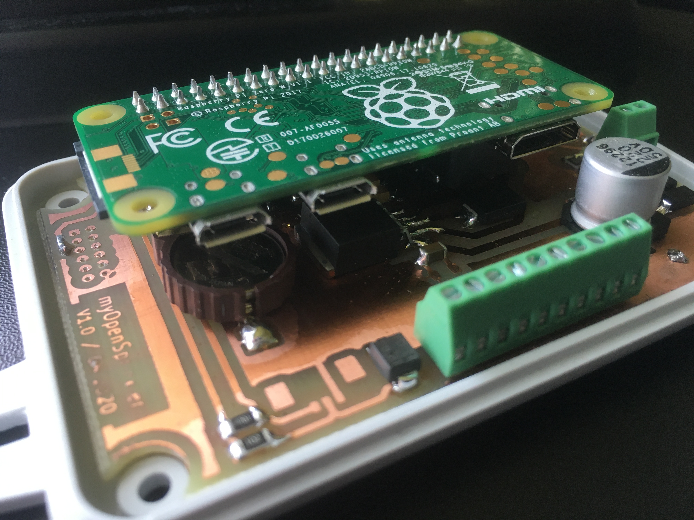

# myOpenSprinkler
open-source RaspberryPi sprinkler valve controller

This repo includes the KiCad project.

**Features:**
- designed for RaspberryPi Zero W
- small form factor

* inspired by OpenSprinkler Pi project
* supports OpenSprinkler software

- controls 8 zones (8x24VAC valves)
- optical insulation between the power-triacs and RaspberryPi 
- integrated 24VAC to 5V converter (no power connector required for RaspberryPi)
- includes a real-time-clock (RTC) module
- rain sensor input
- transient voltage protection

* connector for RFM12B radio transceiver (used for remote sensing/control)  [drivers not available yet]
* 1-wire communication for connecting external temperature sensors [drivers not available yet]

**Hardware v1.0:**

 
 
